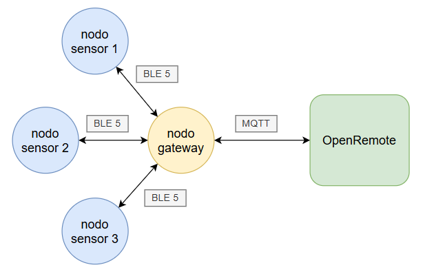

# Sistema de monitoreo y gestión remota de invernaderos - Plataforma
Proyecto realizado dentro del marco del Trabajo Profesional de Ingeniería Electrónica de la Facultad de Ingeniería de la Universidad de Buenos Aires

## Descripción del sistema
El sistema de monitoreo y gestión remota de invernadores consta de las siguientes partes:
- **[ Nodo sensor](https://github.com/matiasvinas/esp32c3-sensor)**: dispositivo responsable de medir temperatura, humedad del suelo, tensión de batería del sensor y envíar los datos a través de BLE Mesh al nodo *gateway*.
- **[Nodo *gateway*](https://github.com/matiasvinas/esp32c3-gateway)**: dispositivo responsable de controlar actuadores y envíar datos de los sensores a la plataforma web a través del protocolo MQTT.  
- **Plataforma web**: inplementada en AWS en base al proyecto de código abierto [Open Remote](https://openremote.io/), con la finalidad de controlar y gestionar los nodos del sistema.

## Topología

Los nodos de la malla Bluetooth están dispuestos en red estrella donde el nodo *gateway* corresponde al nodo central.

## Plataforma Open Remote

Para el instructivo de implementación de Open Remote en AWS, acceder a [ Implementación de Open Remote en AWS ](/implementacion/README.md).

Para el instructivo de configuración de la Interfaz, acceder a [ Configuración de la interfaz de la plataforma Open Remote ](/interfaz/README.md).

## Enlaces útiles

[ Firmware del nodo sensor](https://github.com/matiasvinas/esp32c3-sensor)

[Firmware del nodo *gateway*](https://github.com/matiasvinas/esp32c3-gateway)